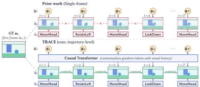

# Temporal Gradient Inversion for Private Trajectory Reconstruction in Embodied Reinforcement Learning

Gradient inversion attack framework for reinforcement learning agents in embodied visual navigation environments. We introduce **T**emporal **R**econstruction **A**ttack on **C**onsecutive **E**ncodings (**TRACE**) that reconstructs observations and recovers actions from intercepted policy gradients using an autoregressive transformer-based architecture.



## Project Structure

```
trace/
├── victim/                # Victim RL agent pipeline
│   ├── training/          # Train PPO / A2C / SAC agents
│   ├── capture/           # Capture gradient trajectories from trained agents
│   ├── augment/           # Augment captured gradients for training data
│   ├── models/            # Victim network architectures
│   ├── config/            # Per-algorithm YAML configs
│   │   ├── ppo/           #   train, capture_{train,test}, augment_{train,test}
│   │   ├── a2c/
│   └── scripts/           # SLURM / shell launch scripts
├── attacker/              # Attacker (inversion) model pipeline
│   ├── training/          # Train the autoregressive inversion model
│   ├── evaluation/        # Evaluate reconstruction quality
│   ├── baselines/         # DLG, IG, Learning-to-Invert baselines
│   ├── models/            # Encoder, decoder, transformer, autoregressive model
│   ├── data/              # Dataset loaders
│   ├── config/            # Per-algorithm YAML configs
│   │   ├── ppo/           #   base, adaptation/, ablation/, ss_ablation/
│   │   ├── a2c/
│   └── scripts/           # SLURM / shell launch scripts
├── defense/               # Defense strategies (DP-SGD, gradient pruning, etc.)
├── evaluation/            # Cross-cutting evaluation & reporting scripts
├── trajectory_data/       # Captured gradient HDF5 files (generated)
└── ckpts/                 # Model checkpoints (generated)
```

## Prerequisites

- Python ≥ 3.13
- [uv](https://docs.astral.sh/uv/) package manager
- CUDA-capable GPU (recommended: A100 40 GB+)

Training is performed on multi-GPU SLURM clusters. Single-GPU training is supported with reduced batch size by adjusting `training.batch_size` and `training.accumulation_steps` in the config.

## Installation

```bash
# Install dependencies with uv
uv sync
```

## Data Generation

The full pipeline generates HDF5 trajectory data under `trajectory_data/`. Follow stages 1–3 below to produce the training and test sets from scratch.

### 1. Train Victim Agent

Train a victim RL agent (PPO or A2C) on AI2-THOR visual navigation:

```bash
# PPO
uv run -m victim.training.train victim/config/ppo/train.yaml

# A2C
uv run -m victim.training.train victim/config/a2c/train.yaml
```

### 2. Capture Gradient Trajectories

Capture gradient snapshots from the trained victim during rollouts:

```bash
# PPO
uv run -m victim.capture.capture victim/config/ppo/capture_train.yaml
uv run -m victim.capture.capture victim/config/ppo/capture_test.yaml

# A2C
uv run -m victim.capture.capture victim/config/a2c/capture_train.yaml
uv run -m victim.capture.capture victim/config/a2c/capture_test.yaml
```

### 3. Augment Gradient Data

Apply data augmentation (temporal shifts, noise, etc.) to the captured gradients:

```bash
# PPO
uv run -m victim.augment.augment victim/config/ppo/augment_train.yaml

# A2C
uv run -m victim.augment.augment victim/config/a2c/augment_train.yaml
```

The generated HDF5 files are expected at the paths specified in each experiment config (e.g., `trajectory_data/ppo/gradients_train_augmented.h5`).

## Training

### Train TRACE

Train the autoregressive gradient inversion model.

**Single GPU:**

```bash
uv run -m attacker.training.train attacker/config/ppo/base.yaml
```

**Distributed (multi-GPU):**

```bash
NGPUS=4  # adjust to your setup
uv run -m torch.distributed.run \
    --standalone \
    --nproc_per_node=$NGPUS \
    -m attacker.training.train \
    attacker/config/ppo/base.yaml
```

### Ablation Studies

**Sequence length ablation** (T = 1, 8, 16, 32, 64):

```bash
uv run -m attacker.training.train attacker/config/ppo/ablation/train_t1.yaml
uv run -m attacker.training.train attacker/config/ppo/ablation/train_t8.yaml
uv run -m attacker.training.train attacker/config/ppo/ablation/train_t16.yaml
uv run -m attacker.training.train attacker/config/ppo/ablation/train_t32.yaml
uv run -m attacker.training.train attacker/config/ppo/ablation/train_t64.yaml
```

**Loss component ablation:**

```bash
uv run -m attacker.training.train attacker/config/ppo/ablation/train_no_mse.yaml
uv run -m attacker.training.train attacker/config/ppo/ablation/train_no_l1.yaml
uv run -m attacker.training.train attacker/config/ppo/ablation/train_no_lpips.yaml
uv run -m attacker.training.train attacker/config/ppo/ablation/train_no_action.yaml
```

**Gradient subspace ablation:**

```bash
uv run -m attacker.training.train attacker/config/ppo/ablation/train_cnn_only.yaml
uv run -m attacker.training.train attacker/config/ppo/ablation/train_fc_only.yaml
uv run -m attacker.training.train attacker/config/ppo/ablation/train_heads_only.yaml
```

### Few-Shot Adaptation

Fine-tune a pretrained model on a small fraction of out-of-distribution data:

```bash
# 10% adaptation on PPO gradients
uv run -m attacker.training.train attacker/config/ppo/adaptation/10.yaml

# 10% adaptation on A2C gradients
uv run -m attacker.training.train attacker/config/a2c/adaptation/10.yaml
```

Available fractions: `10`, `20`, `30`, `40`, `50` (percent).

## Evaluation

```bash
uv run -m attacker.evaluation.evaluate attacker/config/ppo/eval.yaml
```

### Metrics

| Metric          | Description                                              |
| --------------- | -------------------------------------------------------- |
| PSNR            | Peak Signal-to-Noise Ratio (dB)                          |
| SSIM            | Structural Similarity Index                              |
| LPIPS           | Learned Perceptual Image Patch Similarity (VGG backbone) |
| Action Accuracy | Top-1 classification accuracy over discrete actions      |

All image metrics are computed per-frame and averaged across the test set. Per-timestep breakdowns are also reported.

### Baselines

Four baselines are implemented under `attacker/baselines/`:

| Baseline                 | File                    | Reference                    |
| ------------------------ | ----------------------- | ---------------------------- |
| DLG                      | `dlg.py`                | Zhu et al., NeurIPS 2019     |
| Inverting Gradients (IG) | `ig.py`                 | Geiping et al., NeurIPS 2020 |
| Learning to Invert (LtI) | `learning_to_invert.py` | Wu et al., UAI 2023          |

```bash
uv run -m attacker.evaluation.evaluate attacker/config/ppo/eval_baselines.yaml
```

### Defense Evaluation

Evaluate reconstruction quality under gradient defense mechanisms (quantization, pruning, noise injection, DP-SGD):

```bash
# PPO
uv run -m defense.evaluate defense/config/ppo/eval_defenses.yaml

# A2C
uv run -m defense.evaluate defense/config/a2c/eval_defenses.yaml
```

Results (comparison charts, reconstruction grids, and CSV summaries) are saved to the directory specified in the config's `output.save_dir`.

## Configuration

All experiments are driven by YAML config files under `victim/config/` and `attacker/config/`. Key sections:

| Section    | Description                                        |
| ---------- | -------------------------------------------------- |
| `data`     | HDF5 paths, gradient dimensions, data fractions    |
| `model`    | Architecture (sequence length, transformer layers) |
| `training` | Epochs, LR schedule, scheduled sampling, rollout   |
| `loss`     | MSE, L1, action, LPIPS weights                     |
| `eval`     | Evaluation dataset and sequence count              |
| `wandb`    | Weights & Biases logging                           |

## Acknowledgements

We gratefully acknowledge the authors of the following open-source repositories, whose code we adapted for our baseline implementations:

- **DLG** — [Deep Leakage from Gradients](https://github.com/mit-han-lab/dlg)
- **IG** — [Inverting Gradients](https://github.com/JonasGeiping/invertinggradients)
- **Learning-to-Invert** — [Learning to Invert](https://github.com/wrh14/Learning_to_Invert)

## License

This project is licensed under the MIT License. See [LICENSE](LICENSE) for details.
